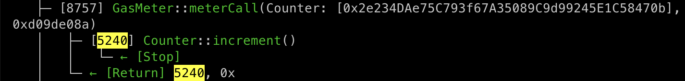

## GasMeter

A simple contract to accurately measure gas consumption of contract calls.

It can be useful for CTFs and gas golfing competition authors.



### Why? 

When you try to naively measure the gas consumption of a contract call by doing something like:
```
uint256 startGas = gasleft();
result = contract.doSomething();
uint256 gasUsed = startGas - gasleft();
```

It actually meters much more gas than only what was consumed by the called contract, including but not limited to:
- Checking that the contract that is about to be called actually exists
- Checking the success of the call and otherwise reverting with the returned data
- Paying the gas cost of warming the contract if it was cold
- Decoding the result of the call (and reverting on errors like incorrect size)
- Various stack and memory manipulation (such as copying the return data to memory)

This metering contract is designed to meter only the gas consumed by the called contract, and nothing else.

For example, it would be nice to see an accurate gas consumption score such as: 137 gas (instead of e.g. 5672 gas).

Because it clearly shows how much gas was consumed by the solution's contract, and how close it is to the bare minimum.

## Installation

```shell
forge install orenyomtov/gas-meter
```

## Usage

Example usage:

```solidity
pragma solidity ^0.8.0;

import { GasMeter } from "gas-meter/HuffDeployer.sol";

contract Example {
    function example_static_call() view public {
        (uint256 gasUsed, bytes memory returnData) = gasMeter.meterStaticCall(
            address(counter),
            abi.encodeWithSignature("number()")
        );
        uint256 returnedNumber = abi.decode(returnData, (uint256));
        console.log("gas measured for number() was %s, and the value returned was %s", gasUsed, returnedNumber);
    }
    
    function example_call() public {
        (uint256 gasUsed,) = gasMeter.meterCall(
            address(counter),
            abi.encodeWithSignature("setNumber(uint256)", 12345)
        );
        console.log("gas measured for setNumber(12345) was %s", gasUsed);
    }
}
```

You may also read the [test file](test/GasMeter.t.sol) for an example of using the [GasMeter](src/GasMeter.sol) contract.

### Test

```shell
$ forge test -vvvv
```
